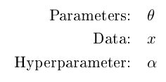
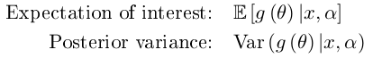
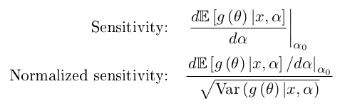
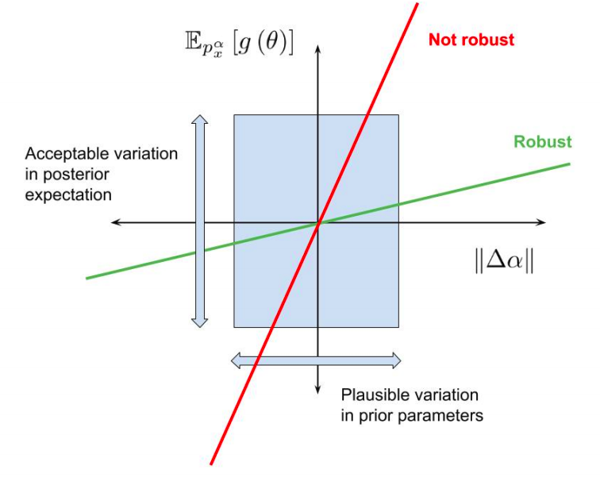

# StanSensitivity

This package contains tools that allow users
to automatically generate local sensitivity measures to hyperparameters in
[Stan](http://mc-stan.org/) using the [RStan](http://mc-stan.org/interfaces/rstan.html) interface.

In Bayesian analysis, priors and likelihoods typically have hyperparameters that
are fixed by the modeler. Naturally, posterior expectations of parameters are
functions of these hyperparameters.  If a range of hyperparameters are
plausible, one hopes that the posterior expectations don't depend too strongly
on the particular values of the hyperparameters.  A model and dataset is called
"robust" when relevant posterior expectations don't vary meaningfully as the
hyperparameters vary over their plausible values.

For example, in the `normal_censored` stan example, the likelihood has a fixed
value of `y_var=1`. If we aren't sure that `y_var` should be exactly `1`, we
might hope that the expectation of the parameter `mu` doesn't depend too
strongly on the precise value of `y_var`. Here is a graph of the actual
dependence (in blue):


Evaluating the exact dependence of posterior expectations on the hyperparameters
typically requires re-fitting the model many times, which can be expensive.
That is what we did to form the above graph. However, it is possible to form a
linear approximation to the dependence (shown in red above) using only samples
at a fixed value of the hyperparameters [1,2,3].  Our package,
`rstansensitivity`, estimates this linear approximation. It only needs draws
from the posterior at one fixed value of the hyperparameters (alpha naught in
the figure, which corresponds to `y_var=1` in the example).

## Some caveats

There are some caveats to be aware of.

1. Linear approximations are only that -- approximations.  If the hyperparameter dependences is nonlinear over the range of plausible hyperparameter values, `rstansensitivity` will give you misleading results.  This package is a guide, not substitute for critical thinking about your models!
2. Due to limitations of Stan, we only support sensitivity with respect to real-valued, unconstrained hyperparameters.  (Vectors and matrices are fine.)  **If you declare the hyperparameters as constrained types, the sensitivity measures will be silently incorrect.**
3. We report error bars around the sensitivity measures that are based on normal and autoregressive approximations.  They are only approximate.
4. The package uses a homespun python parser which is not as fully-featured as the core Stan parser.  Some ordinary Stan features
(like comments outside of program blocks) may not be supported.
5. **Invalid sampling leads to invalid sensitivities.**  For example, if you have
a lot of divergent transitions in your sampling run, the sensitivities probably
aren't correct.
6. This package is still in "alpha" -- that is, in development.  **If you want to use it for something important, please contact me (the package author), and I'll be happy to work with you to make sure it's behaving as expected.**  (In fact, feel free to contact me even if what you're doing is not important.)

# Formal definitions

Suppose we have an inference problem with the following quantities:



To perform Bayesian inference, we specify a prior and likelihood which
determine the posterior distribution.


In Stan, the parameters are declared in the `parameters` block, the data
is declared in the `data` block, and hyperparameters are either hard-coded
explicity in the `model` block or passed in through the `data` block.
In the `model` block, the user specifies the prior and likelihood.
Stan uses Markov Chain Monte Carlo to produce approximate draws from the
posterior distribution for a particular choice of the hyperparameters.

Suppose we are interested in the posterior mean of a particular quanity.



Our package uses MCMC draws to estimate the following quantities:



Because changes in posterior expectations are typically only meaningful if
they are an appreciable proportion of the posterior standard deviation,
the normalized senstivity is often a more meaningful number.


# How to use it

The first step, of course, is to install the package.
```
library(devtools)
install_github("rgiordan/StanSensitivity", subdir="rstansensitivity")
```

Once you've done that, there are five steps:
1. Add a hyperparameters block to your original Stan model.
2. In R, run the function `GenerateSensitivityFromModel` on the model with a hyperparameters block. This will generate a few `.stan` files, including a model that is equilvant to the original model with hyperparameters in the data block.
3. Run Stan as usual on the original model with fixed hyperparameters.
4. Using Stan's output, run a few additional commands to calcualte the sensitivities.  Graph and explore.
5. Guided by the sensitivity analysis, verify the results by actually re-fitting with new values of the hyperparameters.

More details now follow.
Some examples can be found in
```examples```, which are based on their namesakes in the
[Stan examples](https://github.com/stan-dev/example-models).  In the detailed instructions below, we will use Stan's `negative_binomial`
esample -- see ```examples/negative_binomial/negative_binomial_original.stan```.

### Add a hyperparameters block

A Stan model's data block typically consists of both data and hyperparameters.  Starting with an existing Stan model and dataset containing hyperparameters, split your ```data``` block into a data block containing parameters that you want to keep fixed and a new ```hyperparameters``` block containing the parameters whose sensitivity you want to evaluate.

For example, the original data block in ```negative_binomial_original.stan``` was:
```
data {
    int<lower=1> N;
    int<lower=0> y[N];
    real weights[N];
    real cauchy_loc_alpha;
    real cauchy_loc_beta;
    real cauchy_scale_alpha;
    real cauchy_scale_beta;
}
```
and in ```negative_binomial.stan``` this is split into
```
data {
    int<lower=1> N;
    int<lower=0> y[N];
}
hyperparameters {
    real weights[N];
    real cauchy_loc_alpha;
    real cauchy_loc_beta;
    real cauchy_scale_alpha;
    real cauchy_scale_beta;
}
```
**Note: hyperparameters must be real-valued and unconstrained.**  There are currently no checks for this -- the sensitivity analysis will simply crash or not make sense!  (If there are constraints, it will silently report sensitivity to the unconstrained value, not the constrained value.)

You also need to put the base values of your hyperparameter in the data file.  In the `negative_binomial` example, you'll want to put lines like `cauchy_loc_alpha <- 0` in the data file `examples/negative_binomial.data.R`.

### Run `GenerateSensitivityFromModel` in R.

Stan can't parse a hyperparameters block on its own, so we parse the model from the previous step with a hyperparameters block into a three different specially named `.stan` files that Stan can actually interpret.  To do this, run (in R):

```
> library(rstansensitivity)
> model_name <- GenerateSensitivityFromModel("/path/to/your/model.stan")
```

Here, `/path/to/your/model.stan` is the path to the model from the previous step containing a hyperparameters block.  For example,
running `GenerateSensitivityFromModle("negative_binomial.stan")`
produces three models: `negative_binomial_generated.stan`,
`negative_binomial_sensitivity.stan`, and `negative_binomial_parameters.stan`.
The only one you need to use directly is the first one, which is equivalent to the original model, with the hyperparameters in the data block.

The variable `model_name` is just the hyperpameters model path with
the `.stan` suffix stripped away.  It will be used as an argument later so the sensitivity functions can find the generated files.

### Run your original model.

Run Stan as usual on the `*_generated.stan` model from the pervious step.
For example, with the `negative_binomial` example we run:

```
# Compile your model.
model <- stan_model(GetSamplingModelFilename(model_name))

# Load the data.
stan_data <- new.env()
source("negative_binomial.data.R", local=stan_data)
stan_data <- as.list(stan_data)

# Run the sampler.
sampling_result <- sampling(model, data=stan_data, chains=3, iter=3000)
```

### Calculate and graph sensitivities.

Using the output up to this point, run a few more R commands:

```
stan_sensitivity_model <- GetStanSensitivityModel(model_name, stan_data)
sens_result <- GetStanSensitivityFromModelFit(sampling_result, stan_sensitivity_model)
tidy_results <- GetTidyResult(sens_result)
PlotSensitivities(tidy_results)
```

`GetStanSensitivityModel` parses and compiles some of the generated models.
Like any Stan model, this will take some time the first time it's run, through
if you set `rstan_options(auto_write=TRUE)` the compiled model will be cached.

`GetStanSensitivityFromModelFit` evaluates the linear approximation using MCMC
draws from the original Stan run.  `GetTidyResult` packs the output into a
tidy dataframe.  `PlotSensitivities` then hopefully makes a graph like this:


*Negative binomial example*

### Check your conclusions!

Re-run Stan to confirm your conclusions!  Don't skip this step --
`rstansensitivity` is hopefully a useful guide, but it's not magic.
Remember that linear approximations are only approximations!

# How to interpret your results

In order to interpret the output to determine whether you may have a robustness
problem, you need to decide three things:

1. What is an acceptable range of variation in the posterior means?
2. What is the plausible range of your hyperparameters?
3. Is it reasonable to expect that the expectations depend linearly on the
hyperparameters over their plausible range?

In general, every situation may admit different answers to these questions,
and we do not make an attempt to answer them automatically.

To help with (1), we do offer the option of reporting the sensitivity divded by the
posterior standard deviation for each parameter.  We call this "normalized
sensitivity":


If you've decided on answers to (1) and (2), and are willing to at least
tentatively that the answer to (3) is "yes", then you can use the linear
approximation to determine whether the range of hyperparameters can cause
the expectation to change by unacceptably large amounts.



In the figure "Negative binomial example" above, suppose we had decided that `cauchy_loc_alpha` might vary from -4 to 4, and that a change of any parameter greater than one posterior standard deviation would be a problem.  This would occur if any parameter had a normalized sensitivity greater than in absolute value than 1 / 4 = 0.25.  However, the most sensitive parameter to `cauchy_loc_alpha` is `alpha`, and its normalized sensitivity is very likely less than 0.05 in magnitude.  So we would decide that sensitivity to `cauchy_loc_alpha` is not a problem -- as long as we believe that the dependence of all the expectations are linear in `cauchy_loc_alpha` between -4 and 4.

For a more in-depth discussion of the relationship between sensitivity and robustness, see Appendix C of our paper [3].

# References

[1]: Local posterior robustness with parametric priors: Maximum and average sensitivity, Basu, Jammalamadaka, Rao, Liu (1996)

[2]: Local sensitivity of posterior expectations, Gustafson (1996)

[3]: [Covariances, Robustness, and Variational Bayes, Giordano, Borderick, Jordan (2017)](https://arxiv.org/abs/1709.02536)
