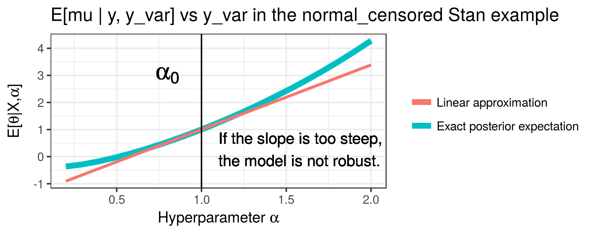

# StanSensitivity

This repo contains tools that allow users
to automatically generate local sensitivity measures to hyperparameters in
[Stan](http://mc-stan.org/) using the [RStan](http://mc-stan.org/interfaces/rstan.html) interface.

In Bayesian analysis, priors and likelihoods typically have hyperparameters
that are fixed my the modeler. Naturally,
posterior expectations of parameters are functions of the hyperparameters.  If a range of hyperparameters are plausible, one hopes
that the posterior expectations don't depend too strongly on the
particular values of the hyperparameters.

For example, in the `normal_censored`
stan example, the likelihood has a fixed value of `y_var=1`.
If we aren't sure that `y_var` should be
exactly `1`, we might hope that the expectation of the parameter `mu`
doesn't depend too strongly on the precise value of `y_var`.
Here is a graph of the actual dependence:



Evaluating the exact dependence of posterior expectations on the hyperparameters typically requires re-fitting the model many times,
which can be expensive.  However, it is possible to form a linear
approximation to the dependence using only samples at a fixed
value of the hyperparameters (shown in red above) [1].  The package `rstansensitivity` estimates this linear approximation.

## Some caveats

There are some caveats to be aware of.

1. Linear approximations are only linear approximations.  If the hyperparameter dependences is nonlinear over the range of plausible hyperparameter values, `rstansensitivity` will give you misleading results.  This package is a guide, not substitute for critical thinking about your models!
2. Due to limitations of Stan, we only support sensitivity with respect to real-valued, unconstrained hyperparameters.  (Vectors and matrices are fine.)  **If you declare the hyperparameters as constrained types, the sensitivity measures will be silently incorrect.**
3. We report error bars around the sensitivity measures that are based on normal approximations.  They are only approximate.
4. The package uses a python parser which is not as fully-featured as the core Stan parser.  Some ordinary Stan features
(like comments outside of program blocks) may not be supported.
5. This package is still in alpha.  If you wnat to use it for something important, please contact me (the package author), and I'll be happy to make sure it's working as expected.  (In fact, feel free to contact me even if what you're doing is not important.)

# How to use it

A Stan model's data block typically consists of both data and hyperparameters.
Local sensitivity of a posterior mean to the hyperparameters can be
computed as the posterior covariance of a log derivative with with parameter[1].
These tools allow you to
easily specify which hyperparameters you're intersted in and automatically
calculate the necessary local sensitivity.

Here are the current steps to use it.  Some examples can be found in
```examples```, which are based on their namesakes in the
[Stan examples](https://github.com/stan-dev/example-models).

1. Install the R pacakge using the command
```
library(devtools)
install_github("rgiordan/StanSensitivity", subdir="rstansensitivity")
```
2. Start with an existing Stan model and dataset containing hyperparameters (e.g. ```examples/negative_binomial/negative_binomial_original.stan``` and
```examples/negative_binomial.data.R```).
3. Split your ```data``` block into a data block containing parameters that
you want to keep fixed and a new ```hyperparameters``` block containing the
parameters whose sensitivity you want to evaluate.  For example, the original
data block in ```negative_binomial_original.stan``` was:
```
data {
    int<lower=1> N;
    int<lower=0> y[N];
    real weights[N];
    real cauchy_loc_alpha;
    real cauchy_loc_beta;
    real cauchy_scale_alpha;
    real cauchy_scale_beta;
}
```
and in ```negative_binomial.stan``` this is split into
```
data {
    int<lower=1> N;
    int<lower=0> y[N];
}
hyperparameters {
    real weights[N];
    real cauchy_loc_alpha;
    real cauchy_loc_beta;
    real cauchy_scale_alpha;
    real cauchy_scale_beta;
}
```
**Note: hyperparameters must be real-valued and unconstrained.**  There are
currently no checks for this -- the sensitivity analysis will simply crash
or not make sense!  (If there are constraints, it will silently report
sensitivity to the unconstrained value, not the constrained value.)
4. Put the base values of your hyperparameter in the data file.  In the `negative_binomial` example, you'll want to put lines like `cauchy_loc_alpha <- 0` in the data file `examples/negative_binomial.data.R`
5. Run a few R commands, following the examples in the `examples` folder.  Hopefully you'll get a graph like this:


[1]: [Covariances, Robustness, and Variational Bayes, Giordano, Borderick, Jordan (2017)](https://arxiv.org/abs/1709.02536)
